# 致谢

非常详细的burp插件开发指南：[bit4woo/burp-api-drops: burp插件开发指南 (github.com)](https://github.com/bit4woo/burp-api-drops)

好不容易找到的合适的国密库：[Tencent/TencentKonaSMSuite (github.com)](https://github.com/Tencent/TencentKonaSMSuite)

优秀的插件：

- [PortSwigger/burpcrypto (github.com)](https://github.com/portswigger/burpcrypto)
- [PortSwigger/crypto-messages-handler: CyRadar Interceptor (github.com)](https://github.com/portswigger/crypto-messages-handler)

# 说明

本插件只作为辅助工具，方便对加密的数据包进行重放、爆破，不能破解加密算法。

程序中存在诸多bug，希望师傅们能提出宝贵的意见和建议。

# 环境

编译环境: jdk16

测试环境: jdk20、burp2023.3.4

# 使用说明

下载jar包或自行编译。

使用original-cryptoTools-0.1.jar即可，cryptoTools-0.1.jar 将 kona-crypto 打包进去了，但是好像并没有生效。

[下载kona-crypto-1.0.8.jar](https://github.com/Tencent/TencentKonaSMSuite/releases/download/v1.0.8/kona-crypto-1.0.8.jar)，将下载目录加入环境，可能需要重启生效。没有依赖将不能使用国密。

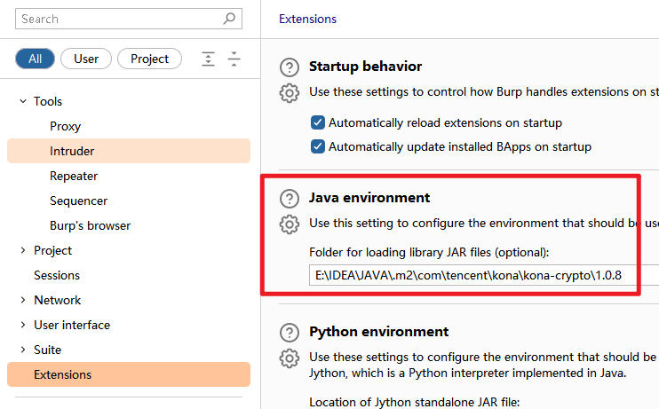

## 自动解密

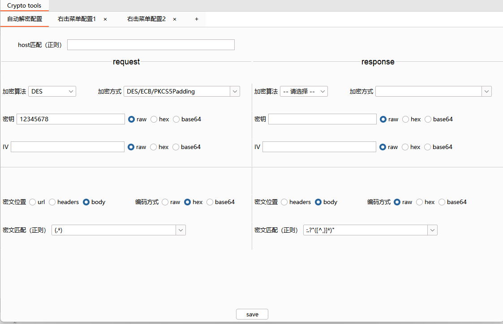

host可以留空，如果不留空则需要host满足正则条件才会显示自动解密窗口（见下方）。但是存在个小bug，有时候不能正常显示解密窗口，再次发送到重放模块即可。

往下是算法的参数，正常配置就好，加密方式这里我不知道怎么获取系统支持的所有方式，所以做了个可编辑的下拉选择框，可以根据实际情况输入。如果不支持会在插件的Errors窗口显示，如下图：

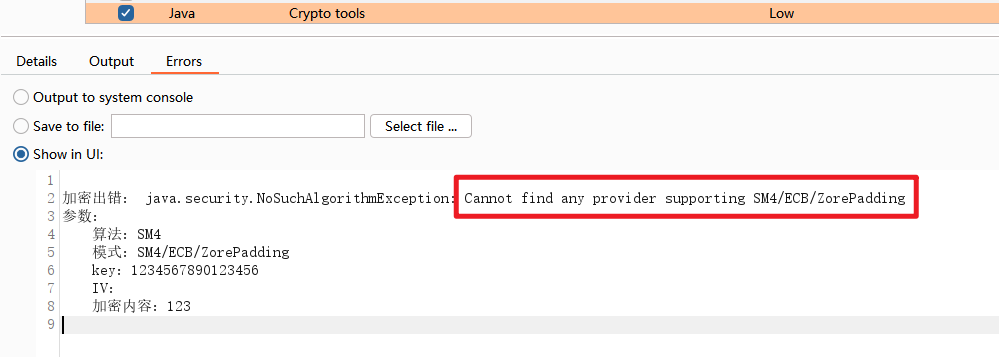

再往下是匹配需要自动加解密的字符串，url是匹配问号后面的内容，headers是将每行作为一个字符串去匹配，body是所有body区域。

这里为了省事只提供了正则的方式。内置了匹配所有json的值（第一个图response下面）和所有url传参的值的正则表达式。匹配方式是循环匹配，对所有满足正则条件的小括号中间的内容进行解密。

自动解密窗口如下图所示，点击Crypto tools，即可看到解密后的内容，内容被修改后会自动加密。如果没能正常加密解密可以到Errors窗口查看错误信息。

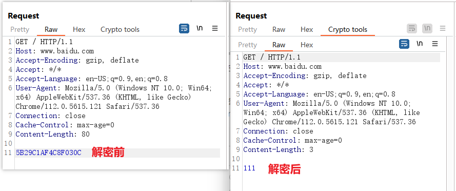

## 右击菜单和Processor

配置页面如下图所示

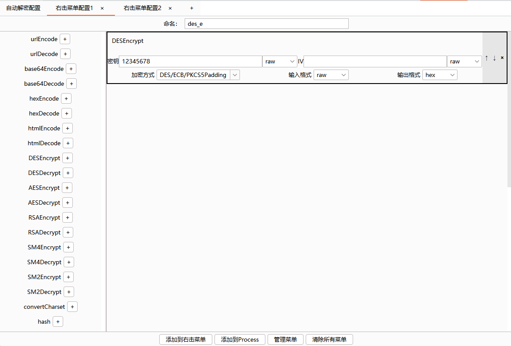

该页面可以配置多个编码或加解密方式，运行时会按顺序依次执行。

如下图，分别配置了sm4加密和解密的右击菜单。

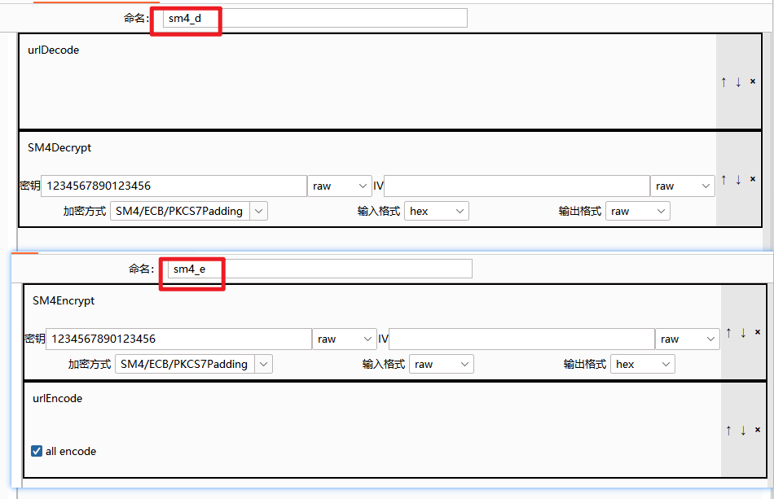

效果如下

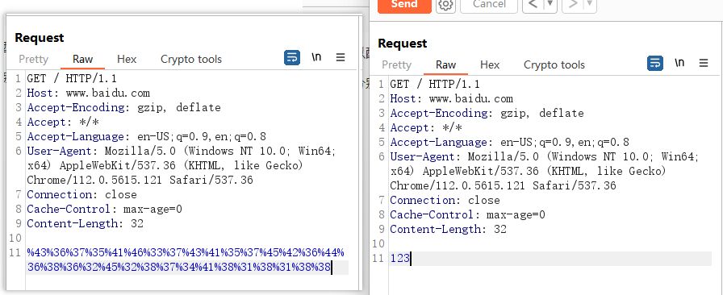

添加到Processor后可以在如下位置选择，如果只要爆破被加密字符串中间的一部分，可以先在数据包中将其他部分去掉，然后在Payload processing中添加prefix和suffix。

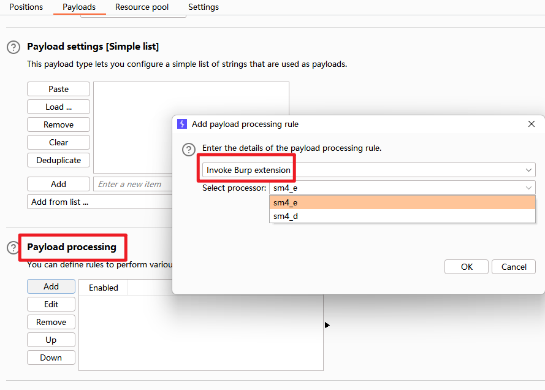

# 关于获取加密算法及参数

第一种方式：直接在源码中搜索"encrypt"、”AES"、"SM4"等关键字。

第二种方式（比较通用）：在浏览器开发者工具->源代码，左边打下XHR断点，然后通过调用堆栈找到内容没加密之前的位置（重复向上打断点），再向下调试，这样比较容易找到加密方法

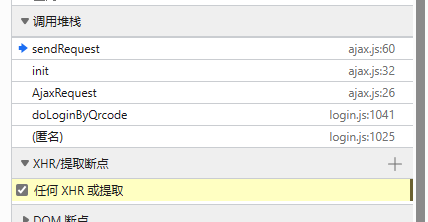

# 关于加密的几种情况

1. 直接使用固定密钥的对称密码（直接找到密钥就行）
2. 客户端生成动态对称密码的密钥，通过公钥加密传输到服务端

这种情况一般将密钥固定即可，方式有事件断点、burp替换、本地文件替换（可能不太好使）等方式。

事件断点，右击断点选择最后一个。

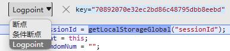

burp自动替换

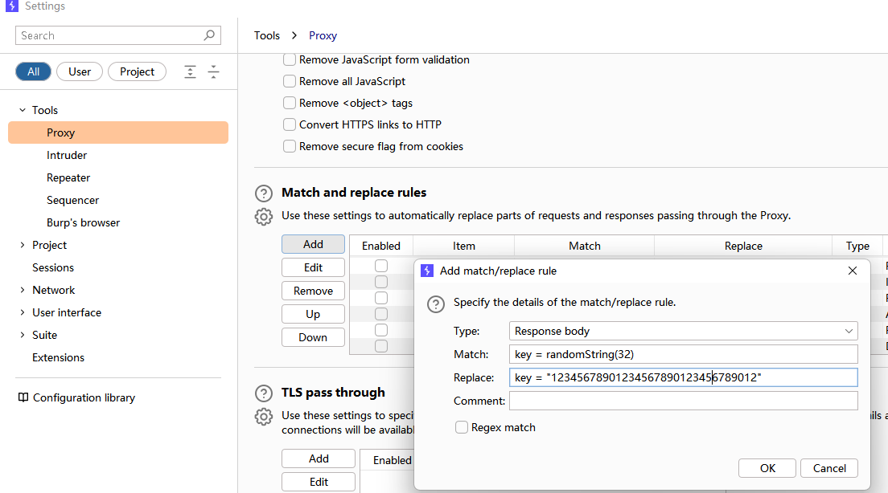

3. 服务端生成对称加密密钥，非对称加密传输（其实不安全），先解密密钥，再用密钥对数据进行解密。本插件用起来会比较麻烦，建议重新一个。
4. 非对称加密传输，在加密函数第一行，在解密函数最后一行加上`data = prompt(data, data)`，如果是json格式，用`JSON.stringify(data)`和`JSON.parse(data)`转化一下（跟大佬学来的方法）
5. 存在签名，重写插件更新签名。

# 矫情一下

前几天刚好重测了去年3月份的系统，那是第一个尝试burp插件的系统，那会甚至连新建一个maven项目都不会，所以选择了python。但是python调试很麻烦，最后是通过打印去排错的，导致那天搞得很晚，第二天项目经理听说了跟我说很心疼，HVV期间直接让我后面休了一天（感恩）。

之后遇到数据加密的情况越来越多，每次都得重新写，所以3月份萌生了写一个比较通用的插件的想法，在这之后发生了很多事情，情绪一直不高，把它搁置到了现在。总算是完成了吧，虽然不是很完美，代码结构比较乱、还有很多bug（比如编码转换应该是不能正常用的），以后有时间在慢慢优化吧。

# 版本

| 时间 | 版本 | 备注 |
| :--: | :--: | :--:|
| 2023/06/18 | 1.0 | 新建 |

