# 致谢

非常详细的burp插件开发指南：[bit4woo/burp-api-drops: burp插件开发指南 (github.com)](https://github.com/bit4woo/burp-api-drops)

好不容易找到的合适的国密库：[Tencent/TencentKonaSMSuite (github.com)](https://github.com/Tencent/TencentKonaSMSuite)

优秀的插件：

- [PortSwigger/burpcrypto (github.com)](https://github.com/portswigger/burpcrypto)
- [PortSwigger/crypto-messages-handler: CyRadar Interceptor (github.com)](https://github.com/portswigger/crypto-messages-handler)

# 说明

本插件只作为辅助工具，方便对加密的数据包进行重放、爆破，不能破解加密算法。

程序中存在诸多bug，希望师傅们能提出宝贵的意见和建议。

# 环境

编译环境: jdk16

测试环境: jdk20、burp2023.7

# 使用说明

[下载jar包](https://github.com/burp-ext-CryptoTools/CryptoTools/releases/tag/2.0)或自行编译。

使用original-cryptoTools-0.1.jar即可，cryptoTools-0.1.jar 将 kona-crypto 打包进去了，但是好像并没有生效。

[下载kona-crypto-1.0.8.jar](https://github.com/Tencent/TencentKonaSMSuite/releases/download/v1.0.8/kona-crypto-1.0.8.jar)，将下载目录加入环境，可能需要重启生效。没有依赖将不能使用国密。

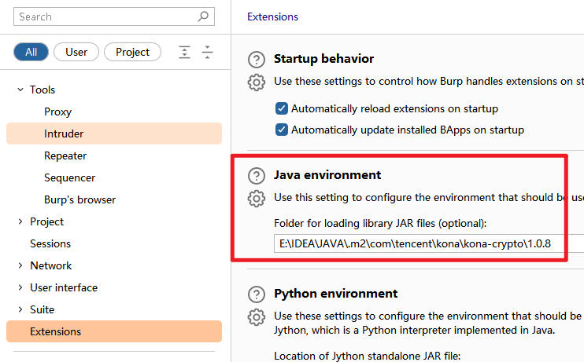

使用中可能会遇到各种各样的问题，可以在Extensions下查看报错信息

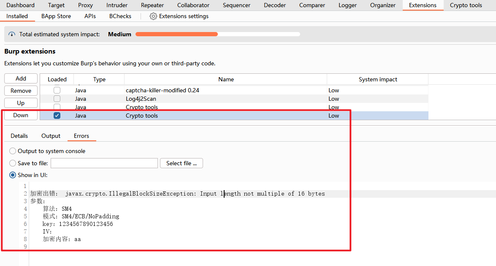

## 自动加解密配置

这里做了更改，配置页面不再直接选择算法配置密钥，改为了先添加算法链，然后再下拉列表中选择，对数据处理上更加灵活。

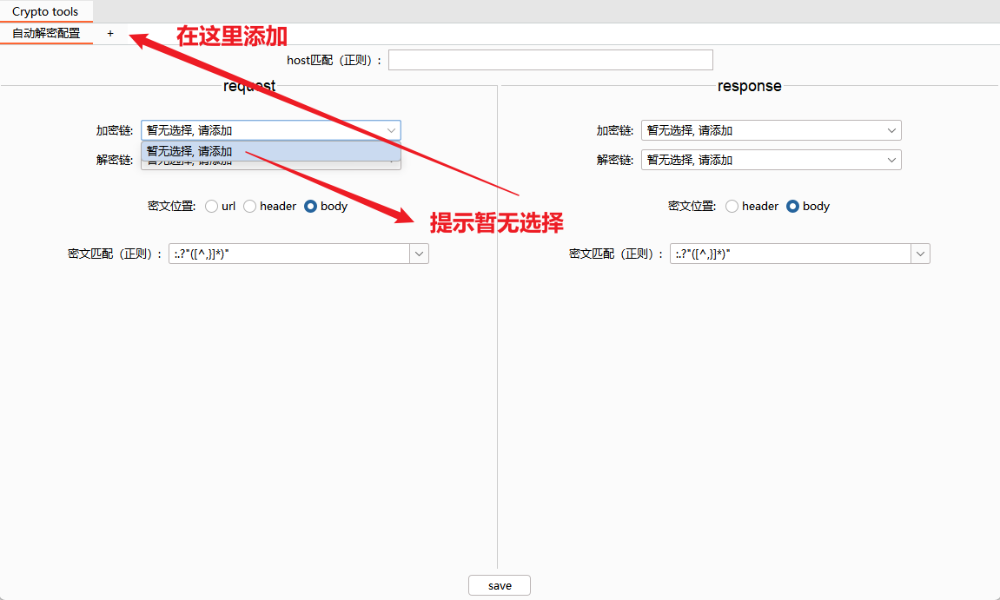

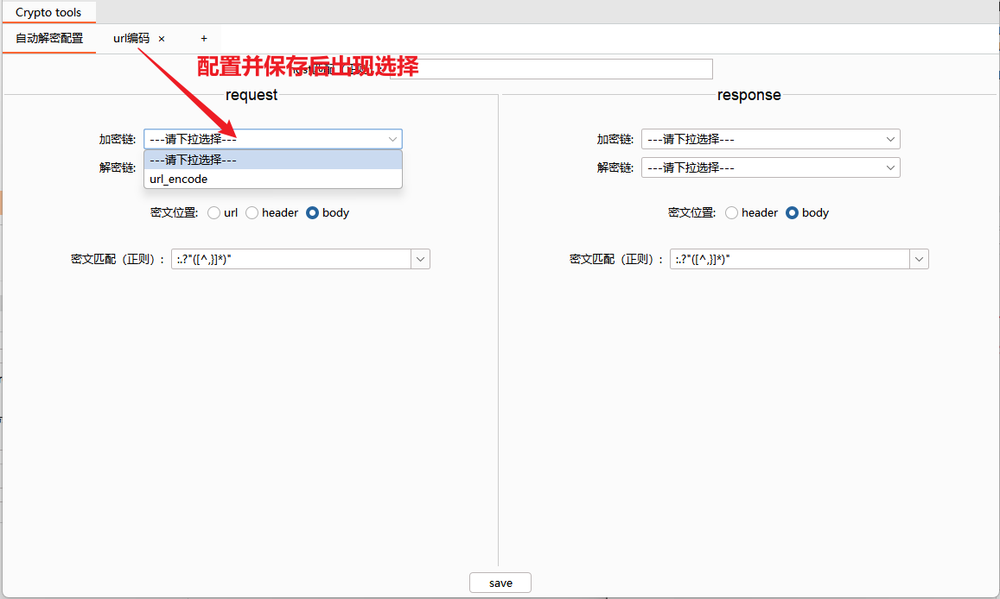

匹配密文的方式依旧没变，还是通过正则，需要替换的内容使用小括号括起来，内置两个规则，分别匹配所有json参数值和url参数值，鼠标悬停会出现提示。

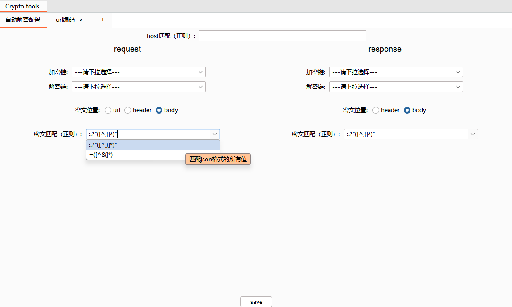

## 加解密链配置

在左侧选择需要的算法，点击+号添加到右边，在右边进行一些参数配置，后面的上下按钮可以改变执行顺序。添加按钮合并为了一个，点击”添加到加解密链“，同时添加到右击菜单、爆破模块和自动解密配置选项中。

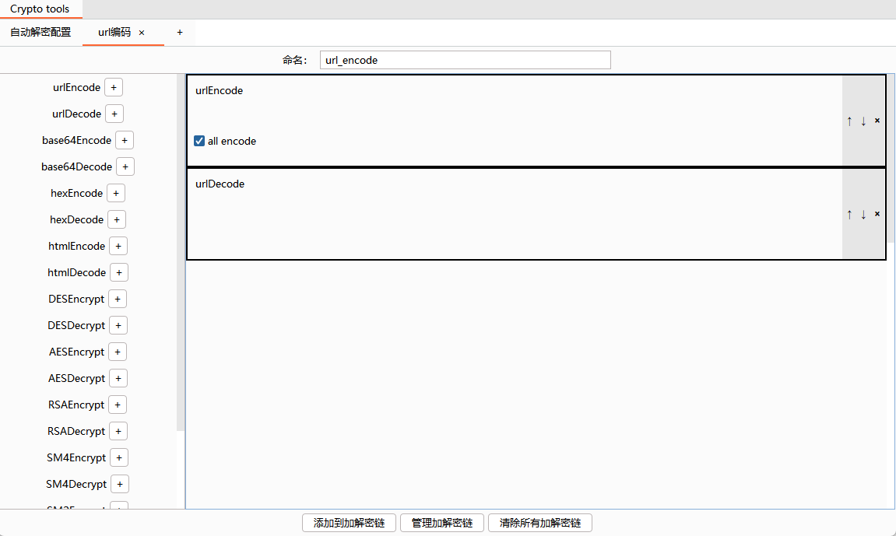

在任意数据包位置可以查看到添加的右击菜单

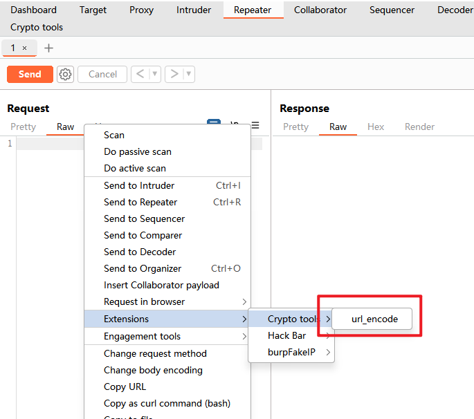

在Intruder模块的payload processing中选择Invoke Burp extension，可以查看到添加的processor

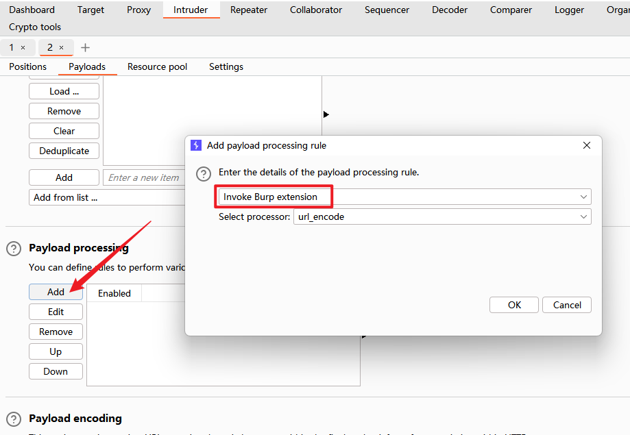

# 演示

## 重放

抓取数据包，请求和响应中的数据都已加密，并且请求和响应的密文有区别

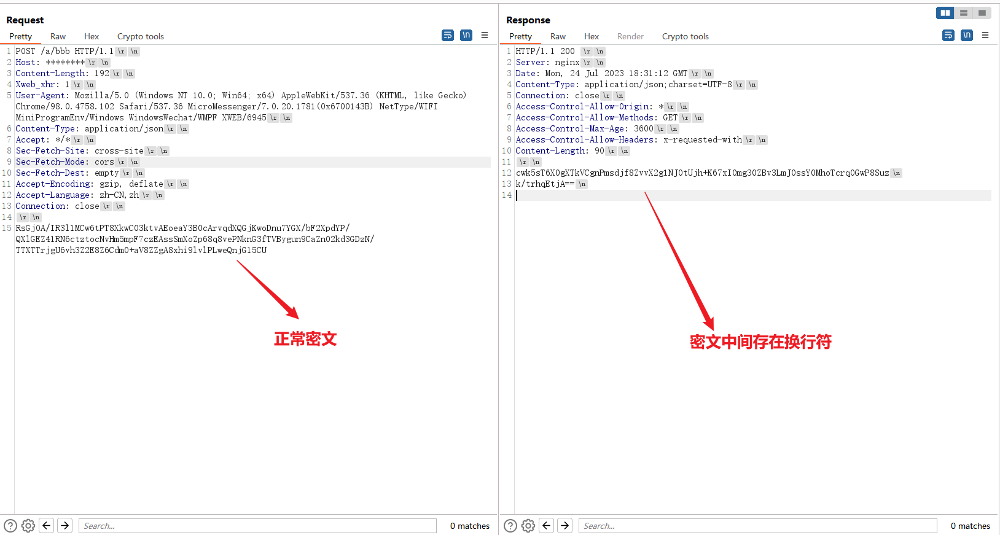

通过分析js文件获取加密算法，和密钥信息，在配置页面进行配置

添加数据包加密的配置，暂时没办法将响应包还原为中间带换行的格式，还好客户端支持不带换行，所以请求包和响应包使用同一个加密配置即可

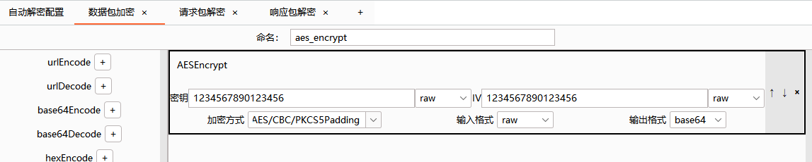

添加请求包解密配置

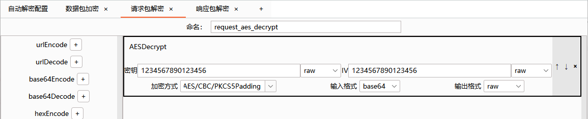

添加响应包解密配置，先将\n替换为空，再进行解密。

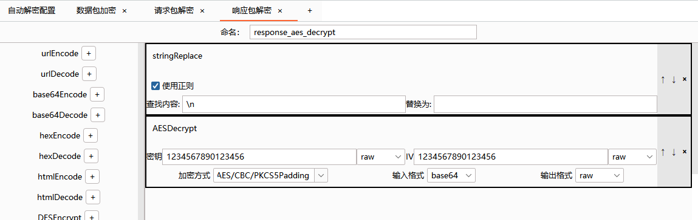

在自动解密配置中选择对应的加解密链，和配置对应的密文，点击save按钮，弹出提示即可。

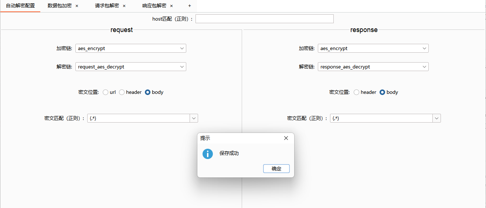

回到重放模块，点击Crypto tools标签即可查看明文，并且可以直接对明文进行修改。

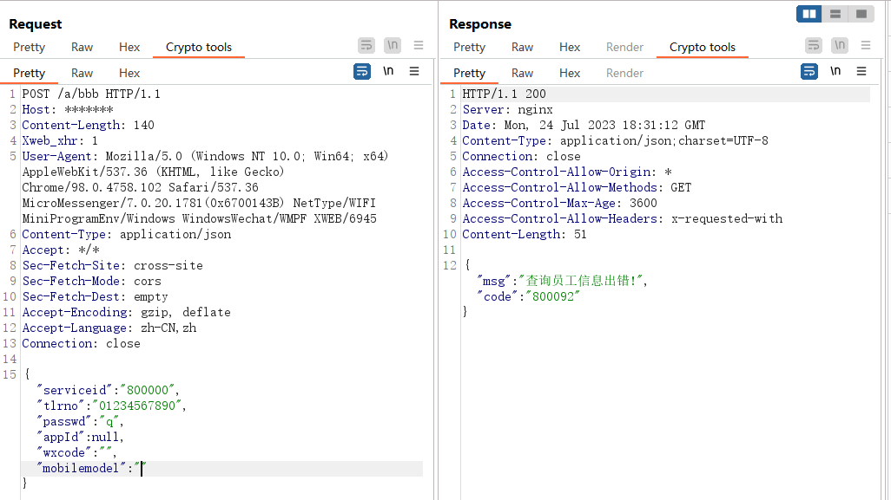

## 爆破

如果需要对上述数据包的passwd进行爆破，可以如下操作

1、将刚刚的数据包发送到Intruder，删除所有加密数据，添加 § 符号。

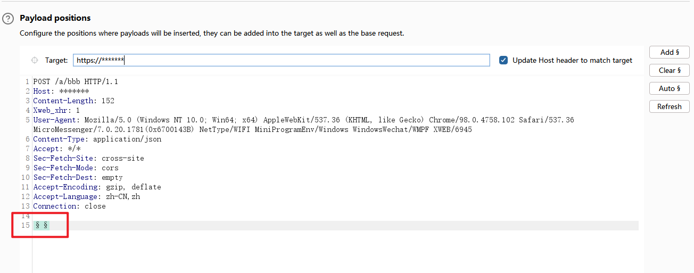

2、将不需要爆破的内容提取出来，添加prefix和suffix，再加插件生成的processor。

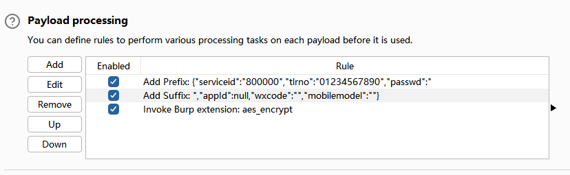

查看爆破的payload

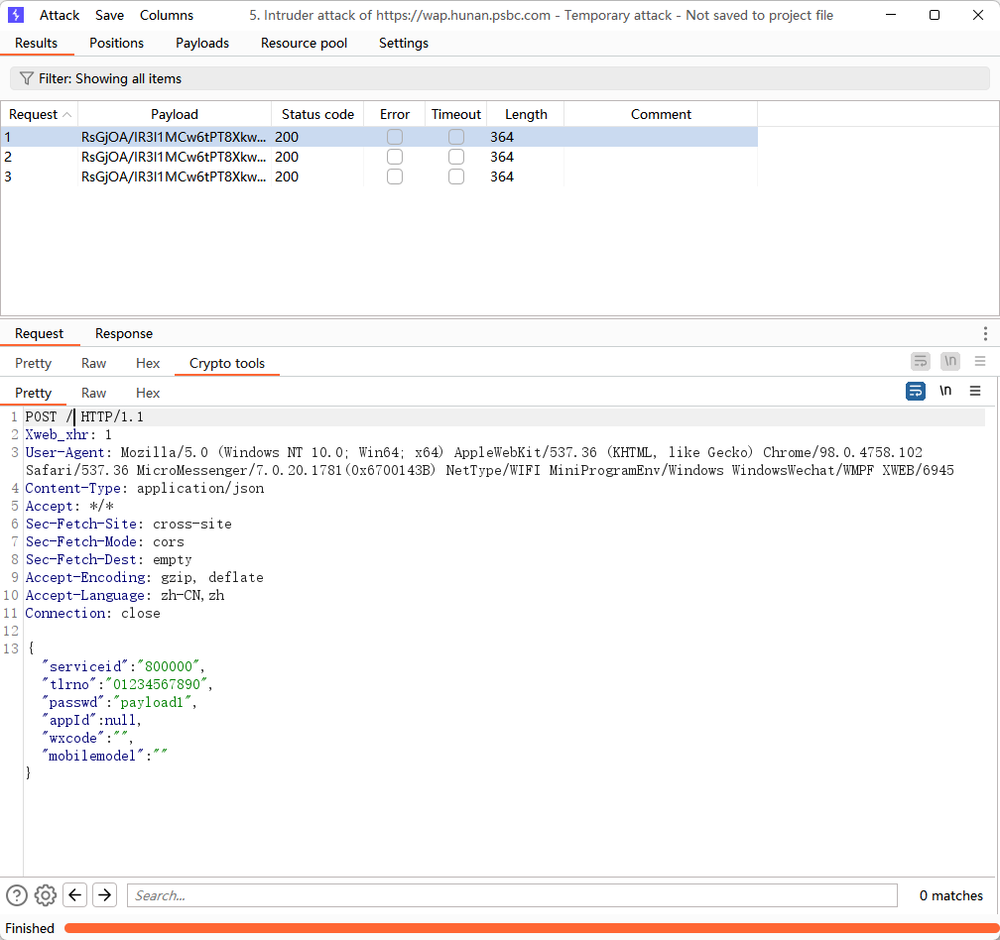

同时可以在Extensions页面查看payload的变化过程。

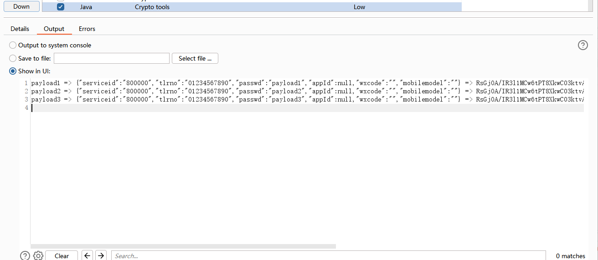

# 关于获取加密算法及参数

第一种方式：直接在源码中搜索参数名、"encrypt"、”AES"、"SM4"等关键字。

第二种方式（比较通用）：在浏览器开发者工具->源代码，左边打下XHR断点，然后通过调用堆栈找到内容没加密之前的位置（过程中可以重复在堆栈下面的函数打断点，然后重新发送请求），再单步调试，这样比较容易找到加密方法

# 关于加密的几种情况

1. 直接使用固定密钥的对称密码（直接找到密钥就行）
2. 客户端生成动态对称密码的密钥，通过公钥加密传输到服务端

这种情况一般将密钥固定即可，方式有事件断点、burp替换、本地文件替换（可能不太好使）等方式。

事件断点，右击断点选择最后一个。

burp自动替换

3. 服务端生成对称加密密钥，非对称加密传输（其实不安全），先解密密钥，再用密钥对数据进行解密。本插件用起来会比较麻烦，建议重新写一个。
4. 非对称加密传输，在加密函数第一行，以及在解密函数最后一行加上`data = prompt(data, data)`，如果是json格式，用`JSON.stringify(data)`和`JSON.parse(data)`转化一下（跟大佬学来的方法）
5. 存在签名，建议重新写一个插件自动更新签名，最近发现用yakit也不错，可以添加时间戳标签、进行md5等操作。

# 版本

|    时间    | 版本 |               备注                |
| :--------: | :--: | :-------------------------------: |
| 2023/06/18 | 1.0  |               新建                |
| 2023/07/25 | 2.0  | 更改自动解密配置方式，修改诸多bug |

